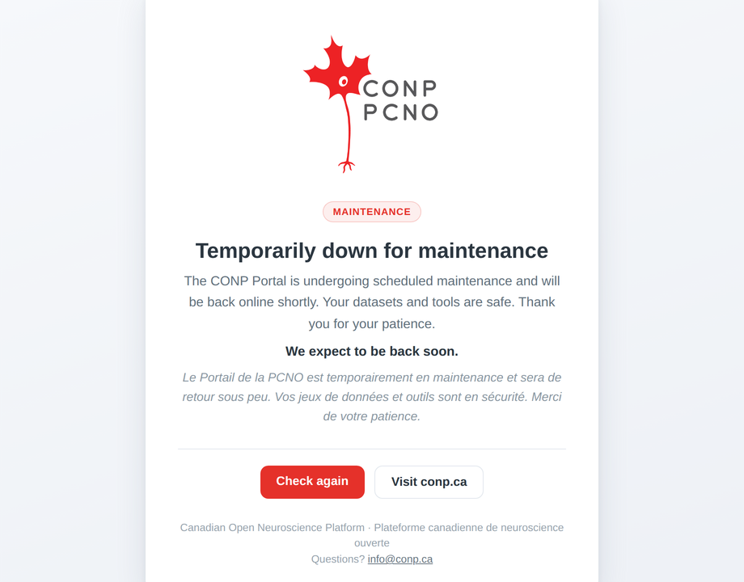

# Maintenance page

`app/static/maintenance.html` is a single, fully self-contained "Temporarily down
for maintenance" page. The CONP/PCNO logo is embedded as a data-URI, so the page
has **no external requests** and renders even when the app, its CDN, or the
documentation service are unavailable. It is bilingual (EN/FR), responsive, and
marked `noindex`.



## Customise

- **Expected-return line** — edit the text in the `<p id="eta">` element (or
  delete that line to hide it).
- **Auto-refresh** — the page reloads every 5 minutes
  (`<meta http-equiv="refresh" content="300">`) so visitors return automatically
  once the site is back. Change the seconds value or remove the line to disable.

## Activate it (nginx)

Serve the page with **HTTP 503 (Service Unavailable)** and a **`Retry-After`**
header so browsers and search engines treat the outage as temporary. This nginx
approach flips on/off with a single flag file and works even while the app is
stopped or restarting.

Inside the portal `server { }` block:

```nginx
# Flip maintenance on/off by creating/removing this file (no reload needed):
#   sudo touch /etc/nginx/maintenance.on   # ON
#   sudo rm    /etc/nginx/maintenance.on   # OFF
set $maintenance 0;
if (-f /etc/nginx/maintenance.on) { set $maintenance 1; }

# Optional: keep testing the live site from one IP while maintenance is on.
if ($remote_addr = 203.0.113.10) { set $maintenance 0; }   # <- your IP

location / {
    if ($maintenance = 1) { return 503; }
    # ... existing proxy_pass to the app ...
}

error_page 503 @maintenance;
location @maintenance {
    # Point this at wherever the file is deployed. If the app's static dir is
    # already served by nginx, alias straight to it; otherwise copy the file to
    # a path nginx can read (e.g. /var/www/conp/maintenance.html).
    alias /path/to/conp-portal/app/static/maintenance.html;
    default_type text/html;
    add_header Retry-After 3600;          # seconds; a hint
    add_header Cache-Control "no-store";
}
```

Toggle:

```bash
sudo touch /etc/nginx/maintenance.on   # turn ON
sudo rm    /etc/nginx/maintenance.on   # turn OFF
```

The `if (-f ...)` test runs per request, so no `nginx -s reload` is needed to
flip it.

> If the portal isn't behind an nginx you control, the same page can instead be
> returned from a Flask `before_request` guard that 503s all routes while a flag
> file exists — but the nginx switch above is preferred because it keeps working
> even when the app itself is down.
